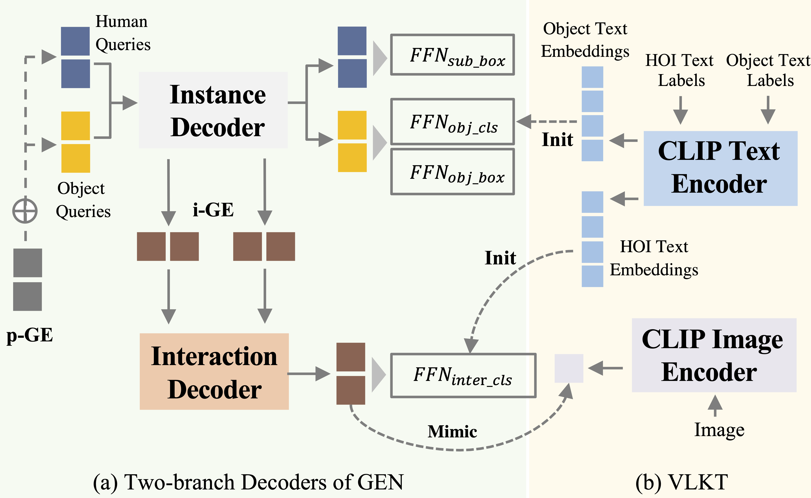

# GEN-VLKT
Code for our CVPR 2022 paper "[GEN-VLKT: Simplify Association and Enhance Interaction Understanding for HOI Detection](https://arxiv.org/pdf/2203.13954)".

Contributed by [Yue Liao*](https://liaoyue.net/), Aixi Zhang*, Miao Lu, Yongliang Wang, Xiaobo Li and [Si Liu](http://colalab.org/people).



## Installation
Installl the dependencies.
```
pip install -r requirements.txt
```
Clone and build CLIP.
```
git clone https://github.com/openai/CLIP.git && cd CLIP && python setup.py develop && cd ..
```
## Data preparation

### HICO-DET
HICO-DET dataset can be downloaded [here](https://drive.google.com/open?id=1QZcJmGVlF9f4h-XLWe9Gkmnmj2z1gSnk). After finishing downloading, unpack the tarball (`hico_20160224_det.tar.gz`) to the `data` directory.

Instead of using the original annotations files, we use the annotation files provided by the PPDM authors. The annotation files can be downloaded from [here](https://drive.google.com/open?id=1WI-gsNLS-t0Kh8TVki1wXqc3y2Ow1f2R). The downloaded annotation files have to be placed as follows.
```
data
 └─ hico_20160224_det
     |─ annotations
     |   |─ trainval_hico.json
     |   |─ test_hico.json
     |   └─ corre_hico.npy
     :
```

### V-COCO
First clone the repository of V-COCO from [here](https://github.com/s-gupta/v-coco), and then follow the instruction to generate the file `instances_vcoco_all_2014.json`. Next, download the prior file `prior.pickle` from [here](https://drive.google.com/drive/folders/10uuzvMUCVVv95-xAZg5KS94QXm7QXZW4). Place the files and make directories as follows.
```
GEN-VLKT
 |─ data
 │   └─ v-coco
 |       |─ data
 |       |   |─ instances_vcoco_all_2014.json
 |       |   :
 |       |─ prior.pickle
 |       |─ images
 |       |   |─ train2014
 |       |   |   |─ COCO_train2014_000000000009.jpg
 |       |   |   :
 |       |   └─ val2014
 |       |       |─ COCO_val2014_000000000042.jpg
 |       |       :
 |       |─ annotations
 :       :
```
For our implementation, the annotation file have to be converted to the HOIA format. The conversion can be conducted as follows.
```
PYTHONPATH=data/v-coco \
        python convert_vcoco_annotations.py \
        --load_path data/v-coco/data \
        --prior_path data/v-coco/prior.pickle \
        --save_path data/v-coco/annotations
```
Note that only Python2 can be used for this conversion because `vsrl_utils.py` in the v-coco repository shows a error with Python3.

V-COCO annotations with the HOIA format, `corre_vcoco.npy`, `test_vcoco.json`, and `trainval_vcoco.json` will be generated to `annotations` directory.


## Pre-trained model
Download the pretrained model of DETR detector for [ResNet50](https://dl.fbaipublicfiles.com/detr/detr-r50-e632da11.pth), and put it to the `params` directory.
```
python ./tools/convert_parameters.py \
        --load_path params/detr-r50-e632da11.pth \
        --save_path params/detr-r50-pre-2branch-hico.pth \
        --num_queries 64

python ./tools/convert_parameters.py \
        --load_path params/detr-r50-e632da11.pth \
        --save_path params/detr-r50-pre-2branch-vcoco.pth \
        --dataset vcoco \
        --num_queries 64
```

## Training
After the preparation, you can start training with the following commands.
### HICO-DET
```
sh ./config/hico_s.sh
```

### V-COCO
```
sh ./configs/vcoco_s.sh
```
### Zero-shot
```
sh ./configs/hico_s_zs_nf_uc.sh
```

## Evaluation

### HICO-DET
You can conduct the evaluation with trained parameters for HICO-DET as follows.
```
python -m torch.distributed.launch \
        --nproc_per_node=8 \
        --use_env \
        main.py \
        --pretrained pretrained/hico_gen_vlkt_s.pth \
        --dataset_file hico \
        --hoi_path data/hico_20160224_det \
        --num_obj_classes 80 \
        --num_verb_classes 117 \
        --backbone resnet50 \
        --num_queries 64 \
        --dec_layers 3 \
        --eval \
        --with_clip_label \
        --with_obj_clip_label \
        --use_nms_filter
```

For the official evaluation (reported in paper), you need to covert the prediction file to a official prediction format following [this file](./tools/covert_annot_for_official_eval.py), and then follow [PPDM](https://github.com/YueLiao/PPDM) evaluation steps.
### V-COCO
Firstly, you need the add the following main function to the vsrl_eval.py in data/v-coco.
```
if __name__ == '__main__':
  import sys

  vsrl_annot_file = 'data/vcoco/vcoco_test.json'
  coco_file = 'data/instances_vcoco_all_2014.json'
  split_file = 'data/splits/vcoco_test.ids'

  vcocoeval = VCOCOeval(vsrl_annot_file, coco_file, split_file)

  det_file = sys.argv[1]
  vcocoeval._do_eval(det_file, ovr_thresh=0.5)
```

Next, for the official evaluation of V-COCO, a pickle file of detection results have to be generated. You can generate the file with the following command. and then evaluate it as follows.
```
python generate_vcoco_official.py \
        --param_path pretrained/VCOCO_GEN_VLKT_S.pth \
        --save_path vcoco.pickle \
        --hoi_path data/v-coco \
        --num_queries 64 \
        --dec_layers 3 \
        --use_nms_filter \
        --with_clip_label \
        --with_obj_clip_label

cd data/v-coco
python vsrl_eval.py vcoco.pickle

```

### Zero-shot
```
python -m torch.distributed.launch \
        --nproc_per_node=8 \
        --use_env \
        main.py \
        --pretrained pretrained/hico_gen_vlkt_s.pth \
        --dataset_file hico \
        --hoi_path data/hico_20160224_det \
        --num_obj_classes 80 \
        --num_verb_classes 117 \
        --backbone resnet50 \
        --num_queries 64 \
        --dec_layers 3 \
        --eval \
        --with_clip_label \
        --with_obj_clip_label \
        --use_nms_filter \
        --zero_shot_type rare_first \
        --del_unseen
```

## Regular HOI Detection Results

### HICO-DET
|                    | Full (D) |Rare (D)|Non-rare (D)|Full(KO)|Rare (KO)|Non-rare (KO)|Download| Conifg|
|:-------------------|:--------:| :---: | :---: | :---: |:-------:|:-----------:| :---: | :---: |
| GEN-VLKT-S (R50)   |  33.75   | 29.25 |35.10 | 36.78|  32.75  |    37.99    | [model](https://drive.google.com/file/d/1dcxY41-fBZ1J_Rh_41VolliCwLa7qgk1/view?usp=sharing) | [config](./configs/hico_s.sh)|
| GEN-VLKT-M* (R101) |  34.63   | 30.04|  36.01|  37.97|  33.72  |  39.24 | [model](https://drive.google.com/file/d/1rAS0gEOx2-L3qeprYal4oLgatQgSPtJJ/view?usp=sharing) | [config](./configs/hico_m.sh)|
| GEN-VLKT-L (R101)  |  34.95   |  31.18| 36.08 | 38.22|  34.36  |    39.37    | [model](https://drive.google.com/file/d/1wTSrpCZujg6kqHbikRrGbUafStggFXjh/view?usp=sharing) |[config](./configs/hico_l.sh) |

D: Default, KO: Known object, *: The original model is lost and the provided checkpoint performance is slightly different from the paper reported.


### V-COCO
| | Scenario 1 | Scenario 2 | Download | Config | 
| :--- | :---: | :---: | :---: | :---: |
|GEN-VLKT-S (R50)| 62.41| 64.46 | [model](https://drive.google.com/file/d/1bPlr1_jhRabcG9N4B8NN4vUr63q4Go-Y/view?usp=sharing) |[config](./configs/vcoco_s.sh) |
|GEN-VLKT-M (R101)| 63.28| 65.58 | [model](https://drive.google.com/file/d/1q9KrHLfaDA6TGu5obqxrCxGlxq5iauAR/view?usp=sharing) |[config](./configs/vcoco_m.sh) |
|GEN-VLKT-L (R101)| 63.58 |65.93 | [model](https://drive.google.com/file/d/1y_AYdF_BewWTZfDPEiSOy72e-63x_rDC/view?usp=sharing) |[config](./configs/vcoco_l.sh) |

## Zero-shot HOI Detection Results
| |Type |Unseen| Seen| Full|Download| Conifg|
| :--- | :---: | :---: | :---: | :---: | :---: |  :---: |
| GEN-VLKT-S|RF-UC |21.36 |32.91 |30.56| [model](https://drive.google.com/file/d/1h4NKPNfbH9ixED6X6-4oH5mGkeOJmW0M/view?usp=sharing)|[config](./configs/hico_s_zs_rf_uc.sh)|
| GEN-VLKT-S|NF-UC |25.05| 23.38| 23.71| [model](https://drive.google.com/file/d/1J1UdauMnzc1cM-OOqMrwXpnJwBGj5pe6/view?usp=sharing)|[config](./configs/hico_s_zs_nf_uc.sh)|
| GEN-VLKT-S|UO |10.51| 28.92| 25.63| [model](https://drive.google.com/file/d/19nEAr1IIeTryYFeVA6SY1pmmEpvw3eUD/view?usp=sharing)|[config](./configs/hico_s_zs_uo.sh)|
| GEN-VLKT-S|UV|20.96| 30.23| 28.74| [model](https://drive.google.com/file/d/1lJbsoIgeluYFcBC_pnx5FdT3fOUpMwQl/view?usp=sharing)|[config](./configs/hico_s_zs_uv.sh)|
## Citation
Please consider citing our paper if it helps your research.
```
@article{liao2022gen,
  title={GEN-VLKT: Simplify Association and Enhance Interaction Understanding for HOI Detection},
  author={Liao, Yue and Zhang, Aixi and Lu, Miao and Wang, Yongliang and Li, Xiaobo and Liu, Si},
  journal={arXiv preprint arXiv:2203.13954},
  year={2022}
}
```

## License
GEN-VLKT is released under the MIT license. See [LICENSE](./LICENSE) for additional details.

## Acknowledge
Some of the codes are built upon [PPDM](https://github.com/YueLiao/PPDM), [DETR](https://github.com/facebookresearch/detr), [QPIC](https://github.com/hitachi-rd-cv/qpic) and [CDN](https://github.com/YueLiao/CDN). Thanks them for their great works!

